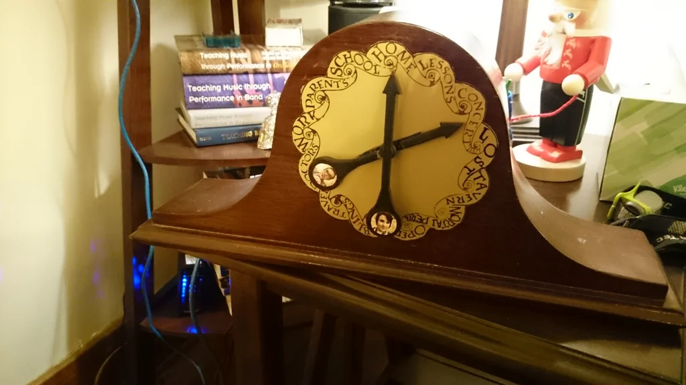

+++
title = "Weasly Clock"
date = 2025-06-18T12:43:25+07:00
summary= "Building the magical Weasly Clock"
toc= false
readTime= false
autonumber= true
math= false
+++

Recently, I’ve become interested in self-hosting, personal VPS setups, and DIY "machines." Thanks to YouTube’s "wonderful" recommendation algorithm, I saw a video about using a Raspberry Pi and a small touchscreen to build a home calendar that keeps track of all family members’ activities—the same thing we’d do with pen and paper on the fridge.

## Inspiration: The Weasley Clock

Suddenly, I thought of the Weasley clock in *Harry Potter*.  
From *Harry Potter and the Goblet of Fire*:

> Mrs. Weasley glanced at the grandfather clock in the corner. Harry liked this clock. It was completely useless if you wanted to know the time, but otherwise very informative. It had nine golden hands, and each of them was engraved with one of the Weasley family’s names. There were no numerals around the face, but descriptions of where each family member might be. “Home,” “school,” and “work” were there, but there was also “traveling,” “lost,” “hospital,” “prison,” and, in the position where the number twelve would be on a normal clock, “mortal peril.”

Building that clock in real life would be literally magic.

## UI Ideas

For the UI, my initial idea is to build a web page where I could render the clock face using simple JS and images. But then I came across another post in the Pi forum where the author reused an old clock for the "UI"—and it’s dope! That’s definitely an option I’ll consider when I build this myself. 💃

## Backend & Data Sources

Technically, the Weasley Clock displays the location of family members. To do that, I would need to somehow connect each family member’s cellphone or other device to the backend. That would pose security risks, and handling such risks for a project like this is a significant overhead. Additionally, the process of configuring and linking each person’s location and activity to the clock is another layer of complexity to consider.
Therefore, I think it would be better to simply display information based on each member’s schedule as set on their personal calendar. This approach reduces overhead and gives users control over what is displayed, rather than tracking their real-time location. At the end of the day, what we want to see on the clock is the activity each member is doing—not their exact location.

For this to work, there should be a web UI for family members to set up their personal schedules and/or link or sync with their Google Calendar or other services.

Recently, I haven’t liked putting all my personal information on a service like Google Calendar, but it’s the default for many people because of its convenience. So perhaps Google Calendar could be the main data source that the app supports, and all setup could happen there? I’ll need to put a lot of thought into this when I start working on it.

## Inspirations & References

- [Build Your Own "Weasley" Location Clock!](https://www.instructables.com/Build-Your-Own-Weasley-Location-Clock/)
- [Harry Potter and the Real-Life Weasley Clock](https://www.raspberrypi.com/news/harry-potter-real-life-weasley-clock/)
- [E-ink weather dashboard (YouTube)](https://www.youtube.com/watch?v=65sda565l9Y)
- [Pi-ntelligent Planner: The Ultimate Family Hub! (YouTube)](https://www.youtube.com/watch?v=6Vf_zj4Ytxg)

